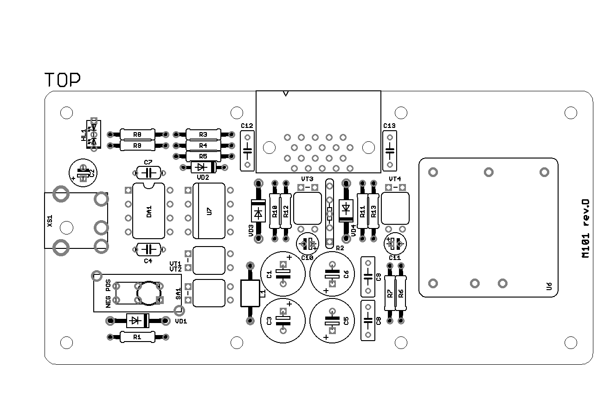
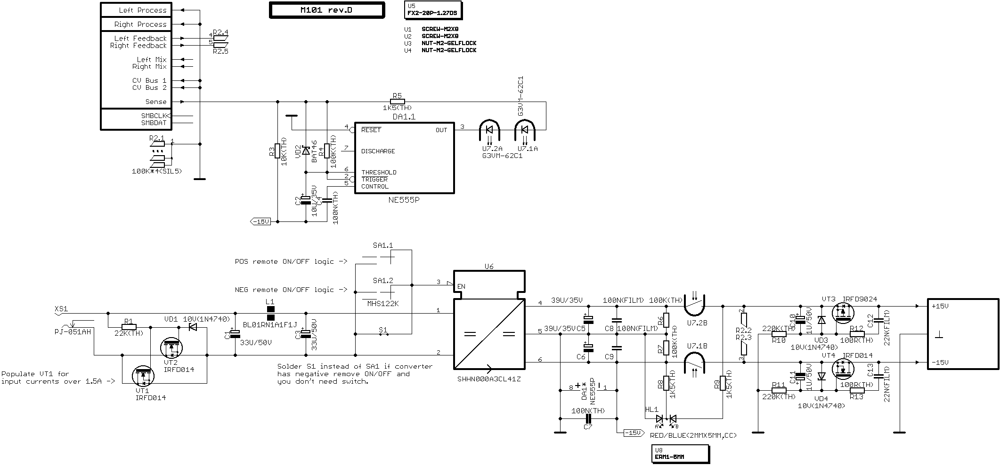

# M101 Power Supply #

	Current version: M101 rev.D
	State: Tested

Basic switched-mode power supply module for [FluorumLabs SonicTrain](http://fluorumlabs.com) modular sound processing system.

## Features ##

 * Up to 15W output power (500mA on positive and negative rails); depends on the DC-DC converter used.
 * 2.0 mm center pin DC power jack (center pin positive).
 * Reverse polarity protection.
 * Supports all ±15V dual output DC-DC converters in industry standard through-hole 1x1 footprint, with optional positive or negative remote ON/OFF control.
 * Optional ON/OFF switch.
 * Automatic optical switch provides power to the rest of the system only after the last (audio output) module is connected, guaranteeing the both rails will be powered simultaneously.
 * MOSFET current limiter for limiting in-rush current on system power-up.

## Ordering and Building Notes ##

The .brd file contains the PCB design in Eagle 7 format. It confirmed to work as is with [OSHPark](https://oshpark.com) or [DirtyPCBs](http://dirtypcbs.com).

Populating the PCB should be relatively straightforward. Some notes:

 * Always check the correct orientation of components:
   * Diodes: square pad on PCB marks **anode**.
   * Electrolytic capacitors: square pad on PCB marks **positive** lead (the long lead).
   * IC, optocoupler: square pad on PCB marks **pin 1** of package.
   * LED: square pad on PCB marks **anode** of the **first diode** (the second longest lead).
   * MOSFET: square pads on PCB mark MOSFET **drain** (two connected pins).

 * The switch orientation depends on remote ON/OFF function of selected DC-DC converter:
   * Positive remote ON/OFF: mount switch in POS position.
   * Negative remove ON/OFF: mount switch in NEG position.
 * If you want to omit switch and selected DC-DC converter has a negative remote ON/OFF function, connect two solder pads beneath the switch on the bottom side of the board.
 * If selected DC-DC converter doesn't have remote ON/OFF feature, leave the switch out.

## Bill of Materials (Assembly M101 rev.D) ##

Qty | RefDes | Component | Notes
--- | ------ | --------- | -----
1 | PCB1 | PCB M101 rev.D |
2 | C1, C3 | Capacitors Aluminium 33u/50V 8x7mm | Low profile
1 | C2 | Capacitors Aluminium 10u/35V 5x7mm | Low profile
2 | C4, C7 | Capacitors Ceramic 100n Radial | Lead space 5mm
2 | C5, C6 | Capacitors Aluminium Organic 39u/35V 8x7mm | Low profile
2 | C8, C9 | Capacitors Film 100n 2.5x7.2x6mm |
2 | C10, C11 | Capacitors Aluminium 1u/50V 4x7mm | Low profile
2 | C12, C13 | Capacitors Film 22n 2.5x7.2x6mm |
1 | DA1 | IC Logic NE555 DIP-8 |
1 | HL1 | LED 2x5x7mm Diffused Red/Blue (Common Cathode) |
1 | L1 | Ferrite Bead Axial |
1 | R1 | Resistors 22k 1% 0.25W |
1 | R2 | Resistors Array 4x100k SIP-5 |
1 | R3 | Resistors 10k 1% 0.25W |
3 | R4, R6, R7 | Resistors 100k 1% 0.25W |
3 | R5, R8, R9 | Resistors 1k5 1% 0.25W |
2 | R10, R11 | Resistors 220k 1% 0.125W |
2 | R12, R13 | Resistors 100R 1% 0.25W |
1 | SA1 | Switches Slide MHS122K | Optional
2 | U1, U2 | Hardware Screw M2x8 Hex |
2 | U3, U4 | Hardware Nut M2 Self-locking |
1 | U5 | Connectors Hirose FX2-20P-1.27DS |
1 | U6 | DC/DC Converter SHHN000A3CL41Z 9W C1 | Any ±15V dual output DC-DC converters in industry standard through-hole 1x1 footprint
1 | U7 | Optocoupler G3VM-62C1 DIP-8 |
1 | U8 | Hardware ERM1-5MM | 5mm LED standoff for HL1
3 | VD1, VD3, VD4 | Diodes Zener 1N4740 10V DO-41 |
1 | VD2 | Diodes BAT46 DO-35 |
2 | VT1, VT2, VT4 | Transistors MOSFET IRFD014 HVMDIP-4 |
1 | VT3 | Transistors MOSFET IRFD9024 HVMDIP-4 |
1 | XS1 | Connectors CUI PJ-051AH 2.0mm |

## Bill of Materials (M101 Power Supply) ##

Qty |  Component | Notes
--- |  --------- | -----
1 |   Assembly M101 rev.D |
1 |   Hardware ZZ050 Bottom | [Bottom plate](enclosure/zz050.dxf)
1 |   Hardware ZM101 Top | [Low profile DC-DC converter and switch](enclosure/zm101.dxf), [Normal DC-DC converter and switch](enclosure/zm101-hp.dxf), [Low profile DC-DC converter and no switch](enclosure/zm101-no-switch.dxf) or [Normal DC-DC converter and no switch](enclosure/zm101-hp-no-switch.dxf)
8 |   Hardware Screw M2x8 Hex |
8 |   Hardware Screw M2x10 Hex |
8 |   Hardware Standoff M2x3 |
8 |   Hardware Standoff M2x9 |
180 |   Hardware Magnetic Tape 12x1.5mm | 2 x 9cm

 ## Schematics ##

 